# SwiftUI: From zero to hero

## Hello brave humans!

Welcome to our SwiftUI workshop! We're happy to have you here!

Your task for today is very simple…

In the next few hours you will be building **Lamstagram** - a brand new social network for Llamas. The market is huge and business success is guaranteed.

Since Alpaca Inc. - our direct competitor - are planning to launch a similar product, we need to move fast. That is why we need to focus on getting a prototype out ASAP so that we can secure the first round of financing by the end of this week.

## The app

Because of the rush, the scope is limited and we’ll be building just a couple of screens.

### Feed

Feed screen lists posts in the feed specific to the logged in user. In the case of our prototype we don’t care about real data. We only care about cute images of llamas.

Tapping on image should bring up its detail. Tapping on heart should "like" the post and the likes should be persistent over all view contexts no matter how the user navigates to the feed.

We will ignore all other functionality for today.


### Photo detail

Photo detail screen is basically the photo presented modally. Simple, eh?

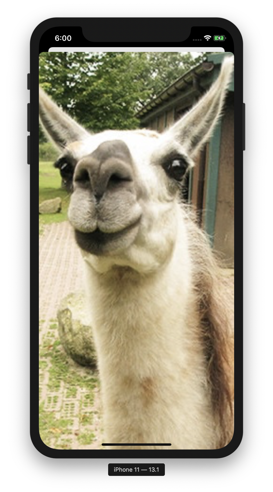

### Profile

The profile screen shows information about currently logged in user. Namely profile photo and information, horizontally scrolling list of friends and list of user's posts in a grid view.


## Navigation

We're not going to build anything too complex here but we need to let the user navigate throughout the app.

### General

#### Tabs

The tab bar at the bottom switches between Feed and Profile screens.


#### Navigation Views

Similar to `UINavigationController` each of the tabs contains a `NavigationView` to allow pushing and popping new views in the stack.

### Feed

#### User info

Tapping on user's photo, name or nickname pushes that user's profile View onto the navigation stack.

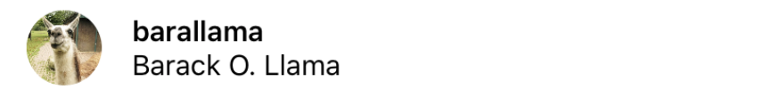

#### Photo

Tapping on the photo presents the photo detail modally.

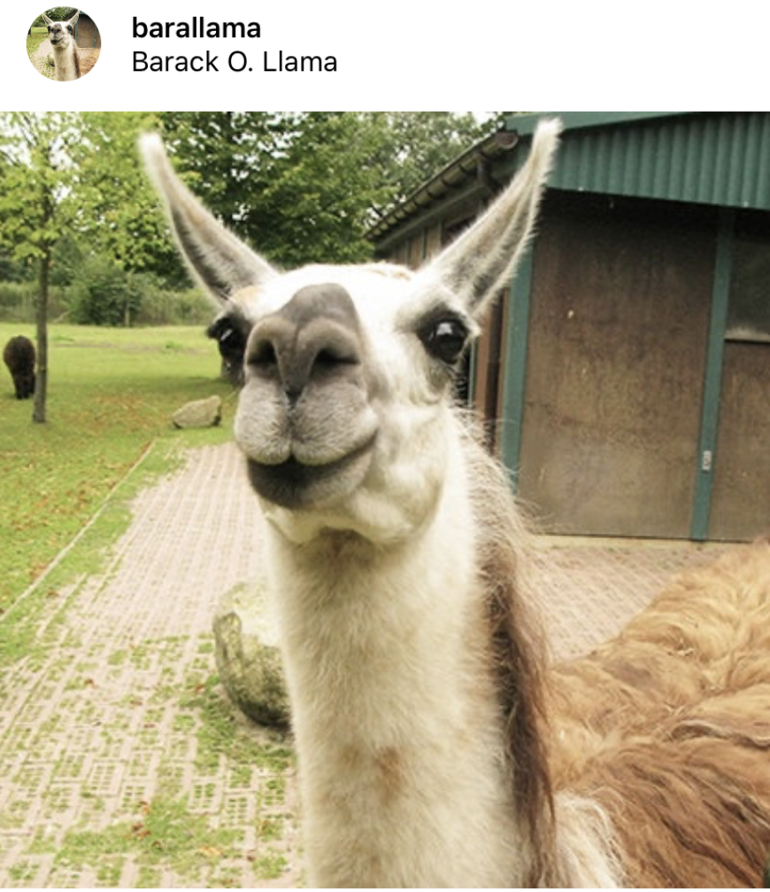

### Profile

Tapping on one of friends pushes their Profile view into the navigation stack.

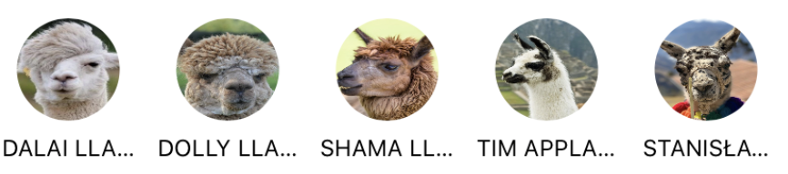

#### Photo

Tapping on one of the photos pushes that user's Feed view into the navigation stack.

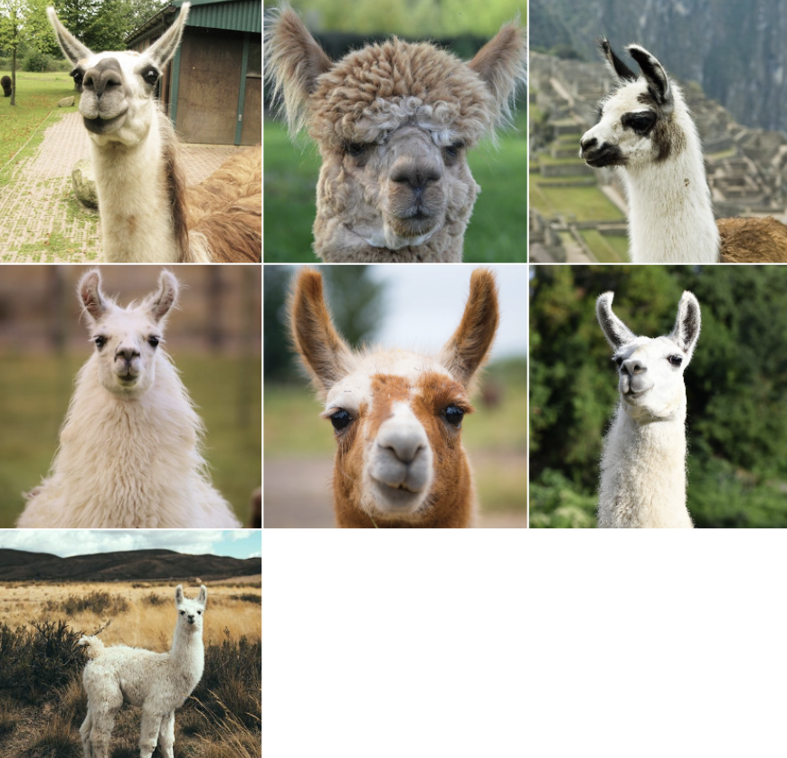

## Let's start coding!

We're here to learn programming in SwiftUI so let's get started.

### The project

I have prepared an Xcode project for you.

Please clone this repository if you haven't done so yet: https://github.com/jankaltoun/lamstagram-workshop

In this repository a lot of things are ready for you so that you can focus purely on building the UI. There are Models and data stores prepared that you will use to display data in your UI. There are also some utilities but more about that later.

Now run the app and you should see a blank view with **Hello world!** message centered on the screen.

The only view ready for you is the root view, the `ContentView`. You can see it contains only one view `Text` with the message. In SwiftUI a view will be centered by default both horizontally and vertically unless specified differently.

Remember that in SwiftUI the views are composable. Simply initialize your view inside another View and it will be displayed within it. The views that accept views always have a result builder closure as their parameters.

For example:

```
VStack {
	Text("Hello")
	Text("World")
}
```

Or more complex:

```
Button {
	print("Hello!")
} label: {
	Text("Hello world!")
}
```

To change appearance or behavior of views we use view modifiers that are simply functions called on the view we want to modify. View modifiers can be chained together.

For example:

```
Image("Photos/1")
	.resizable()
	.clipShape(Circle())
```


Enough of examples!

It's your turn to code now!

## 1. The tab bar

Let's create the [TabBar](https://developer.apple.com/documentation/swiftui/tabview) with two tabs.

When you're done the UI should look like the screenshot below.

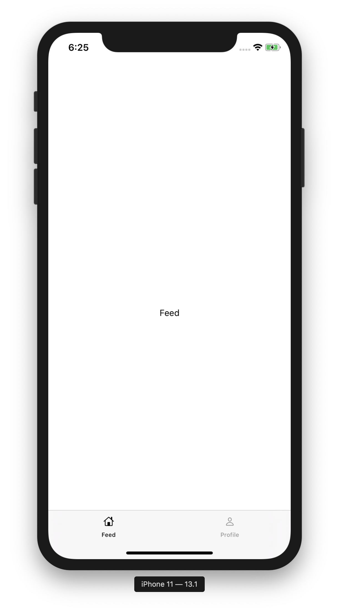

Start by creating a new Swift file named `MainView`. Copy the contents (ha ha) of `ContentView` into it and rename everything from `Content` to `Main`.

Now add the `TabView` into the `body` property of your shiny new View. This property contains the View's UI definition and is present in all SwiftUI views.

For now let's just add a Text view with **Feed** and **Profile** labels respectively for each of the tabs.

Since we're going to need to use pushing and popping in these Views let's also wrap the Text views within the `TabView` in `NavigationView` so that we can do that later.

For the [tab items](https://developer.apple.com/documentation/swiftui/tabview), system images named `house` and `person` are a good choice. `Image` view has a nice `init` that you can use. By the way... These [symbols](https://developer.apple.com/design/human-interface-guidelines/sf-symbols/overview/) and many more are provided by Apple for free!

The view hierarchy should look similar to this:

```swift
TabView
	NavigationView
		Text
	NavigationView
		Text
```

To add some bling, let's apply `.accentColor(.black)` modifier to the whole `TabView` to have a nice black accent on the selected tab item.

While you're at it, let's also apply a `.font` modifier after the accent color to set the global font to be a system font of size 14.

Now in `ContentView` replace `Text("Hello world!")` by your new `MainView()`.

## 2. Feed basics

Now let's create the Feed view. The feed simply displays a list of posts that are provided by the `FeedStore` class that you can find in the `Stores` directory.

The store uses mocked data, because why not.

When you're done the UI should look like the screenshot below.

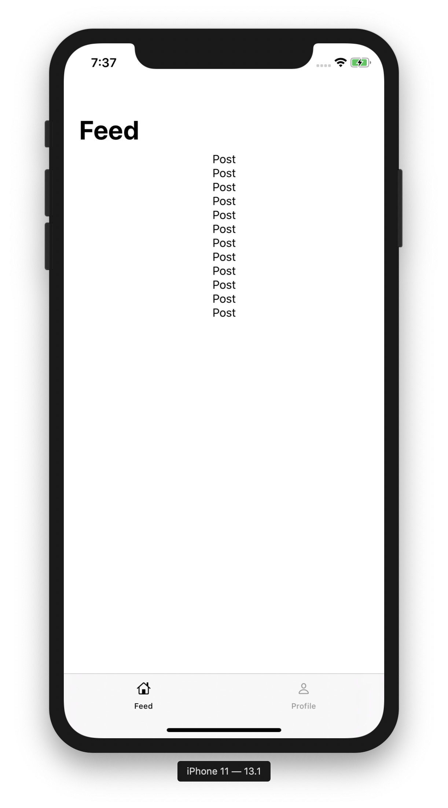

Start by creating a new SwiftUI view from the Xcode template and name it `FeedView`.

### The data

To use data we need to provide it somehow to the `FeedView`. Fortunately this is very simple to do. We're not going to go into the details today but let's imagine that a view can **observe** some object and update itself on its own when the data changed (e.g. when it's fetched from the API). To implement such behavior you will need the `@StateObject` property wrapper.

In your feed view let's add a private variable annotated with `@StateObject` named `feedStore` and initialize it as `FeedStore`.

The feed store will let us display either the full feed (when `user == nil`) or user-specific feed (when `user != nil`). To do that we need to specify the user somehow. Fortunately there's a function named `setUser` on the feed store that we can use.

First though we need to know what the user is and that will be passed to the feed by the view that instantiates it. To make that possible, add a simple `let` property named `user` of type `User?` to `FeedView`.

Last step is to call the function so let's add a view modifier named `.onAppear` to the `Text` that was generated for you by the template. In this `.onAppear` function call `feedStore.setUser` with the user as a parameter.

**A side note:** There is another way of instantiating a wrapped property using its underscore name (`_feedStore`) but this approach is discouraged for `@StateObject` property wrapper due to optimizations that can potentially be implemented by Apple. More about that approach later!

### The UI

The UI here is quite simple...

Start by adding your `FeedView` into your `MainView` (replace the `Text`) so that it gets displayed. Provide `nil` as the `user` parameter's value.

Typically you would use `List` view (an equivalent of `UITableview`) for this but currently there is no way of removing the separators before iOS 15 and in general using `List` still has many limitations. Instead we will use a `ScrollView` with a `LazyVStack` while iterating over our content.

Let's add a [ScrollView](https://developer.apple.com/documentation/swiftui/scrollview) as the the contents of the `body` (replacing the `Text`). If you don't specify axes in its initializer it will default to vertical scrolling.

Now we need to display our posts in the `ScrollView`.

To do that let's add a [LazyVStack](https://developer.apple.com/documentation/swiftui/lazyvstack) within the `ScrollView`. A `LazyVStack` is an optimized version of a `VStack` that does not create all its items at once. It only creates those that are currently needed to be rendered.

Lastly, within the `LazyVStack` let's add a [ForEach](https://developer.apple.com/documentation/swiftui/foreach). `ForEach` lets us enumerate over data and create a set of views based on it.

In this `ForEach` let's iterate over `feedStore`'s `posts` property and let's display a `Text` with the post's text for each one of them.

By the way... `ForEach`'s trailing closure takes one parameter which is the current element. This will be your `post`.

Your view hierarchy should now look similar to this:

```
ScrollView
	LazyVStack
		ForEach
			Text
```

We're in the `NavigationView` context so we need to provide the title for this screen.

To do that let's apply `.navigationTitle()` modifier with a value of `Feed` on the topmost element of `FeedView` (the `ScrollView`).

## 3. Displaying posts

Now is the time to create our `PostView`.

When you're done the UI should look like the screenshot below.

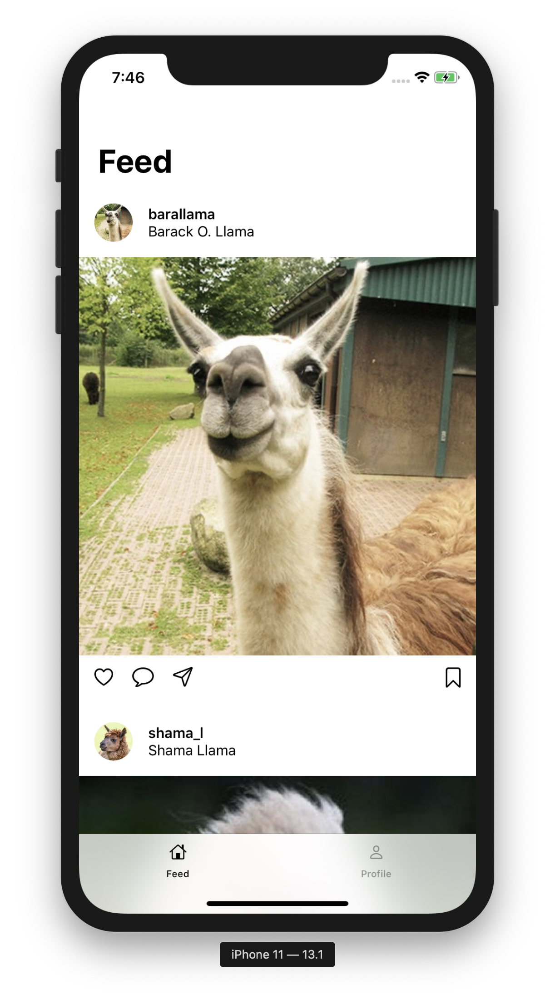

Start by creating a new Swift file using the SwiftUI template and name it `PostView`.

### The data

Our `PostView` needs data and fortunately passing data between views is extremely simple. Just provide it in the initializer as you did with the `user` in `FeedView`! And since all views are `struct`s and `struct`s have automatically synthetised initializers, if we don't want to do anything more complex, we just need to add the property.

Let's add a `let` property named `post` of type `Post` to our `PostView`.

Now go back to the `FeedView`, replace the `Text` with `PostView` and provide `post` as the parameter.

That's it. We can now use the post data in our view.

### The UI

`Postview`s UI is where things get fun!

Look at the screenshot above. The `PostView` consists of three different sections (from the top to bottom):

- Profile information
- Photo
- Toolbar

To construct this view we will need a `VStack` that lets us stack views vertically. Similar to the `LazyVStack` we used a moment ago. We just don't need (or want) the laziness here.

Add a `VStack` with alignment of `.leading` and spacing of 0.

#### Profile information

The profile information will consist of a `HStack` with an `Image` and `VStack` (with two `Text`s). The View hierarchy should look like this:

```
HStack
	Image
	VStack
		Text
		Text
```

This is because the profile photo needs to be positioned at the leading edge and the two Text Views need to be positioned right next to it, one under the other.

First create the `HStack` with spacing of 16. `HStack` is similar to a `VStack`. The only difference is that it stack views horizontally.

In the `HStack` place an image of the user (`post.user.imageName` property).

To make the image look good we need to set some modifiers on it:

- `resizable()` to make the image be able to resize itself
- `clipShape()` with value of `Circle()` to make the image round
- `frame()` with both `width` and `height` of 40 to make the image a nice size

Now add the `VStack` with `alignment` of `.leading`. The 2 `Text`s within should have values of `post.user.nickname` and `post.user.name`.

Finally the top Text view should have a `fontWeight` modifier applied to it with the value of `semibold`.

For added beauty, also apply `padding` modifier without any parameters to the `HStack` to get a system standard padding around the view.

#### Photo

The photo part is super-simple. Let's add an `Image` with a value of `post.imageName`.

To make it size properly, let's add two view modifiers to it:

- `resizable()` to make it be able to resize itself
- `aspectRatio()` with `aspectRatio` (the first unnamed parameter) of 1 and `contentMode` of `.fill` to make the image fill the available space

#### Toolbar

The toolbar is basically just 4 icons next to each other. And by now you know how to stack things!

Let's add an `HStack` with `spacing` of 20.

In the `HStack` add 4 `Image`s with symbols **heart**, **message**, **paperplane** and **bookmark**.

To make the last image be pushed all the way to the trailing edge, add a `Spacer` view between the last two `Image`s.

The last thing to do is to apply a `font` view modifier with system font of size 20 to the `HStack` to make the icons nicely sized.

And again added beauty, also apply `padding` modifier without any parameters to the `HStack` to get a default padding around the view.

#### Wrapping up

This was a lot of code (well, at least as SwiftUI is concerned)! Our view is now beautiful though and so it was definitely worth it. Compare it to the code you'd have to write in UIKit or on other platforms!

Your `PostView` view hierarchy should now look like this:

```
VStack
	HStack
		Image
		VStack
			Text
			Text
	Image
	HStack
		Image
		Image
		Image
		Spacer
		Image
```

## 4. Profile

We're done with the feed for now so let's work on the profile.

When you're finished, the UI should look like the screenshot below.

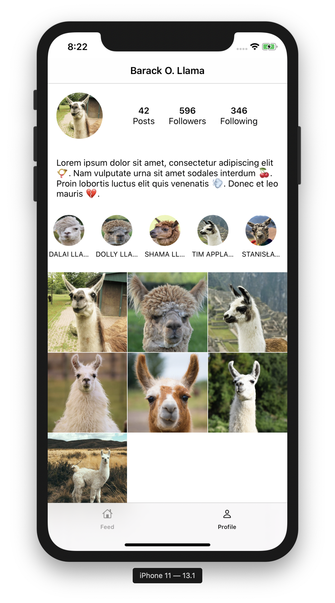

This is **a lot** of UI so we'll need to split this view into multiple views so that we do not create a monster-view (remember and fear the `Massive View Controller` in UIKit and the `Massive View` in SwiftUI).

In fact we will need to create three views for each of the logical sections:

- **Header** with the photo and statistics
- **Friends list** with the list of user's friends
- **Photo grid** with the photos the user posted

Let's start simple by creating a new view and calling it `ProfileView`.

Remember to display this new view in our `MainView` instead of the `Text` placeholder.

### The data

Our `ProfileView` shows user data and so we need to provide some `User` object to it.

We've done this before so let's just add a `let` `user` property of type `User` to this view.

The tricky part here is to get the current user. To simulate authentication, I have prepared a dummy `AuthenticatedUserStore` class. We do not need to care about the details for now.

Since the `ProfileView` now needs the user to be provided to it, we need to access the relevant data store in the `MainView`.

In SwiftUI you can pass data to Views in multiple ways...

- Passing them using `init`
- Using `@Binding` property wrapper
- Using `@StateObject` and `@ObservedObject` property wrappers
- Using `@EnvironmentObbject` property wrapper

Environment objects are similar to Observed objects. The difference is where the stored are initialized.

When we implemented the `feedStore` using `@StateObject` in `FeedView` we had to initialize the store in the view. When using the `@EnvironmentObject` we rely on one of the ancestor views to initialize the object (store) instead.

For authenticated user this is nice as we want this user to be available throughout the app's view hierarchy.

In our case we'll initialize the store in the `SceneDelegate`. Feel free to look at how it's done using `environmentObject()` property wrapper. When you create an environment object like this, all children of this view will have access to the object using the `@EnvironmentObject` property wrapper.

**A side note:** This app uses the "old" app life cycle. In iOS 14 a new SwiftUI life cycle was introduced where we can skip the `AppDelegate` and `SceneDelegate` classes.

Let's do it!

At the top of `MainView` add a `private var` property named `authenticatedUserStore` of type `AuthenticatedUserStore` and annotate it with `@EnvironmentObject` property wrapper.

Now simply pass the `authenticatedUserStore.user` property to the `ProfileView`.

Let's also force-unwrap it as we like to live dangerously and if the user is unauthenticated here, we should crash anyway as this should never happen.

Note: your previews will crash. To fix this issue add the environment object to your previews as well for whichever view you're using the `@EnvironmentObject` property in. For example:

```
struct MainView_Previews: PreviewProvider {
    static var previews: some View {
        MainView()
            .environmentObject(
                AuthenticatedUserStore(user: MockData.users.first!)
            )
    }
}
```

You will need to do this for all views that are ancestors of this view too (e.g. `MainView` and `ContentView`) to make the previews work. Simply add it when you see a crash.

### The UI

Let's now create the skeleton of our `ProfileView`.

Since there may be many photos the view will have to scroll so let's add a vertically scrolling `ScrollView` as the topmost view, replacing the `Text`. Add a `VStack` to it to host its contents.

Let's also create three more views (using the SwiftUI file template) named `ProfileHeaderView`, `ProfileFriendsView` and `ProfilePostsView`.

Add these three views to the `VStack` in the `ProfileView`.

Apply `padding` of 16 to the `ProfileHeaderView` and bottom padding of 16 to the `ProfileFriendsView`. Hint: the first parameter of `padding` property wrapper can be the edge (or set of edges) to which you want to apply the padding.

Lastly apply `navigationTitle` modifier to the `ScrollView` with value of `user.name`. Also add  the `navigationBarTitleDisplayMode` view modifier with a value of `.inline`.

At the end your view hierarchy should look like this:

```
ScrollView
	VStack
		ProfileHeaderView
		ProfileFriendsView
		ProfilePostsView
```

## 5. Profile header

Let's build the profile header view now.

When you're finished the UI should look like the screenshot below.

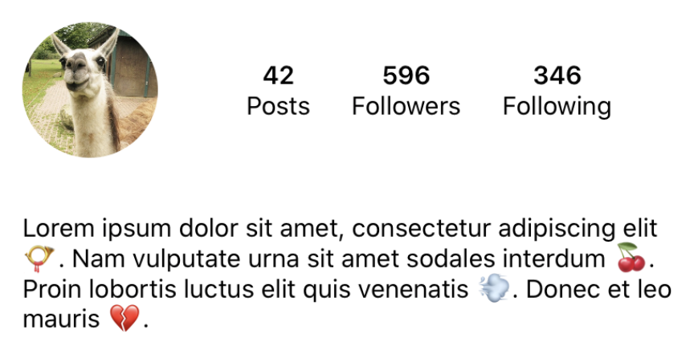

The `ProfileHeaderView` needs to display user information and so we need to pass the user instance to it. You already know how to do this.

The UI is a bit complex but you already know everything from the previous exercises too!

I'm going to leave the coding to you but I'll give you a couple of hints:

- All the data you need is available on the `User` object.
- The spacing of the main `VStack` is 16.
- The spacing of the `HStack` with statistics is 24.
- The width and height of the `Image` is 80.
- You need to apply two modifiers to the long text to size it properly:
  - `.fixedSize(horizontal: false, vertical: true)` 
  - `.frame(maxWidth: .infinity, alignment: .leading)`
- You can use two Spacers to center content
- Font weight of the bold statistics is `.semibold`

In case you become lost, here's a little hint of what your view hierarchy should look like:

```
VStack
	HStack
		Image
		Spacer
		HStack
			VStack
				Text
				Text
			VStack
				Text
				Text
			VStack
				Text
				Text
		Spacer
	Text
```

## 6. Profile friends

Now we need to build the friends view.

When you're finished the UI should look like the screenshot below.

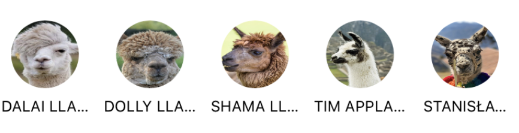

The `ProfileFriendsView` needs to display a horizontally scrolling list of user's friends.

You know the drill! You can build it on your own.

I'm going to give you a few hints again:

- The list of friends is available on the `User` object.
- You will need to wrap the `ForEach` in a `HStack` to make the contents of the horizontal `ScrollView`.
- Try setting the `showIndicators` initializer parameter of the `ScrollView` to `false`.
- Both width and height of the `VStack` should be 75.
- You don't need to set any other frames.
- The image should have an aspect ratio of 1 with content mode of `.fit`.
- The font of friend's name is `.caption`.
- You should set a line limit of `1` for the `Text`.

In case you get lost, here's a little hint of what your view hierarchy should look like:

```
ScrollView
	HStack
		ForEach
			VStack
				Image
				Text
```

## 7. Profile photos

The last view we need to build for our profile to be complete is the post photo grid.

When you're finished the UI should look like the screenshot below.

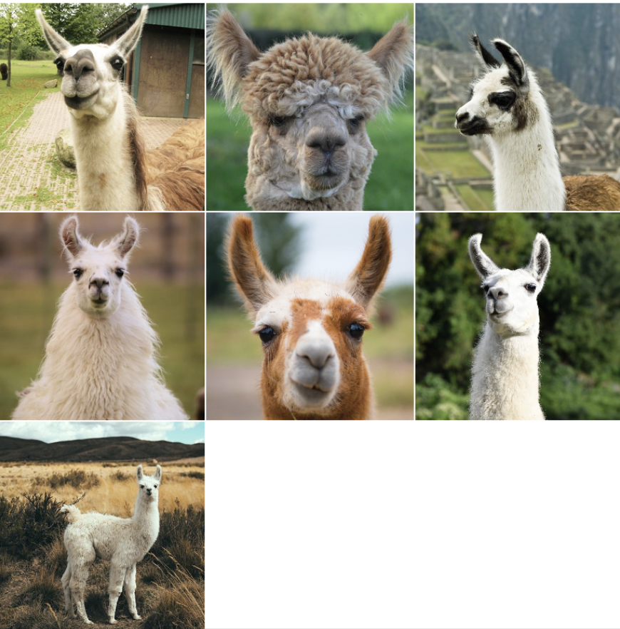

This is where things get a bit complicated...

In UIKit you'd use `UICollectionView` to build a view like this. In SwiftUI (starting with iOS 14) we can use a `LazyHGrid` and `LazyVGrid` to achieve similar results.

In our case we will use a lazy vertical grid.

To initialize a `LazyVGrid` you need to set columns and spacing. In our case the spacing will be very thin - set it to `1`.

The columns are a bit trickier. It is an array of `GridItem` instances that define what our columns should look and behave like. Each item in the array represents one column.

Create a `let` property named `columns` on the view and instantiate it as an array with three `GridItem` instances. Each of the items will have a type of `.flexible()` and spacing of `1`. Whereas the spacing on the `LazyVGrid` defines the vertical spacing, the spacing on the `GridItem` defines the horizontal spacing.

Instantiate the `LazyVGrid` as the topmost view in the `body` of `ProfilePostsView`.

Your `ProfilePostsView` view hierarchy should look like this:

```
LazyVGrid
	ForEach
		Image
```

The rest of the code is composed of the views and view modifiers that we have already used. The grid sets the frames for you so the only thing you really need to do is set the aspect ratio of the `Image`s.

By now your `ProfileView` should be looking swell!

## 8. Navigation

Now it's time to create our transitions.

### Feed post to user profile

As described at the top of this document, tapping on the profile information in the feed should transition us to author's profile.

In SwiftUI this is very simple to do!

Simply go to the `PostView` and wrap the `HStack` containing the profile information in a [NavigationLink](https://developer.apple.com/documentation/swiftui/navigationlink). A `NavigationLink` is a button that when tapped, transitions the user to its `destination` view.

In our example the `destination` should be `ProfileView(user: post.user)` and the trailing closure should contain the `HStack` we wrapped.

### User profile friend photo to user profile

Similarly - as described at the top of this document - tapping on the friend's photo in current user's profile should transition us to the author's profile.

Apply the same approach as above to the `VStack` containing the `Image` and `Text` in the `ProfileFriendsView`.

### User profile post photo to feed

Lastly - again as described at the top of this document - tapping on the post photo in user profile should transition us to the feed of that author's posts.

Apply the same approach as above to the `Image` in the `ProfilePostsView`.

To make the nested feeds recognizable, go to the `FeedView` and replace the static `Feed` navigation title with user's name or the `Feed` text if it's `nil`. The `??` operator is a good choice here.

## 9. Displaying photo detail in feed

One last thing we need to do is to display a modal view with a detail of the photo when user taps it in the feed.

When you're finished the UI should look like the screenshot below.

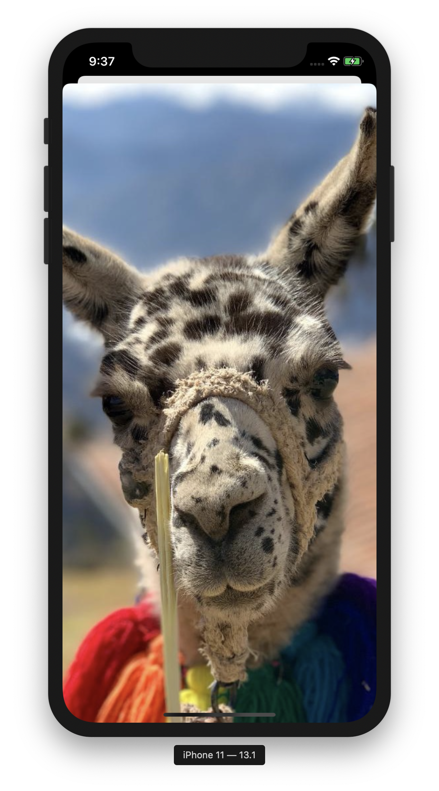

By now you probably know that this will be very easy in SwiftUI. And you're right!

To implement this modal sheet we need to learn about one last piece of information about data storage in SwiftUI. That last piece of today's puzzle is the `@State` property wrapper.

Properties annotated with `@State` are used to store, well, a state of a SwiftUI view. SwiftUI monitors changes of `@State` properties and whenever such property changes SwiftUI invalidates the containing views's appearance and recomputes its `body`. This is exactly the same behaviour as with the `@Published` properties in our `@StateObject` feed store.

By the way... Thanks to the strongly typed nature of SwiftUI this is all done very efficiently and only those views in the view hierarchy that need to change are actually re-rendered.

Modal views in SwiftUI are displayed using the `.sheet` view modifier. This view modifier can be applied to any view and multiple sheets can be presented from a single parent view.

This `sheet` view modifier (in our case) accepts one `Bool` parameter named `isPresented` that decides whether the sheet should be displayed or not. The parameter value is not just a value itself though. It is something called a `Binding` which is basically a two-way connection between a view and its underlying model. This two-way connection is needed as not only - in our case - must a sheet know when to display itself based on the `@State` property value... It also needs to set the value to `false` when user dismissed the sheet by dragging it down.

To implement the sheet in our application we need to go to our `PostView` and a `@State` property named `photoModalIsPresented` with a default value of `false`. This will be the property that decides whether our sheet should be displayed.

Now wrap the `Image` in a `Button` view.

A button in `SwiftUI` takes an `action` closure that defines what should happen when it's tapped and a view builder closure that defines the contents of the button (similar to other views we used today).

Set the button's action to a closure containing one simple line of code: `photoModalIsPresented = true`.

Lastly apply a `sheet()` view modifier to the button and set its `isPresented` parameter to `$photoModalIsPresented`. Notice the dollar sign that is used to access the two-way binding.

The trailing closure of our `sheet` should contain the same `Image` that the button contains. The image should have its aspect ratio's content mode set to `.fill`. Additionally apply a `edgesIgnoringSafeArea` with value of `.all` to the presented `Image` to make it extra-beautiful.

Your code should now look something like this:

```
Button
	Image
.sheet
	Image
```

## 10. Likes

Now that our UI is done, let's play with data storage!

As mentioned at the top of this document, when user taps on the heart icon on a post in the feed, the post should become liked. These likes should persist throughout the app run and so if you like a post in the main feed it should also be marked as liked in that user's feed.

To implement this functionality let's use a naïve local storage that only lasts while the app is running. Let's use `@EnvironmentObject` to implement it. In real world you'd probably trigger a request to some API and this would not be **the** way to handle such scenario. Today we just want to keep it as simple as possible though so it's good enough.

To handle the data layer I have prepared for you the `LikedPostsStore` that is very similar to other stores that we used today.

There are two functions on it that are of interest to us:

- `isLiked(post: Post) -> Bool` - to find whether a post is liked
- `toggle(post: Post)` - to like and unlike a post

The liking/unliking happens in our `PostView`.

First, add the `@EnvironmentObject` property and call it `likedPostsStore`.

Now wrap the **heart** image in a button and make its action to call the `toggle` function on the store you just added.

Lastly we need to make the image react to the liked/unliked state. In the `Image` initializer add a condition and based on the `isLiked` function call result display (set the `systemName` to) either **heart** or **heart.fill** image. A ternary operator like `condition ? "llama" : "alpaca"` is a good choice here.

Now run the app, tap the heart icon and see your app crash. Remember the `environmentObject` call in `SceneDelegate` we talked about earlier?

Add the environment object and your app will work like a charm!

Note: your previews will crash again. To fix this issue add the environment object to your previews as well for whichever view you're using the `@EnvironmentObject` property in.

## 11. Bonus task

Try implementing a "bookmark" functionality. This will be very, very similar to "likes".
Use the "Bookmark" icon all the way to the right below each post.
I would like you to duplicate the likes functionality with its own store and all related things.

## The end

If you made it all the way here, you are brave!

Thank you for attending this workshop and keep coding :).